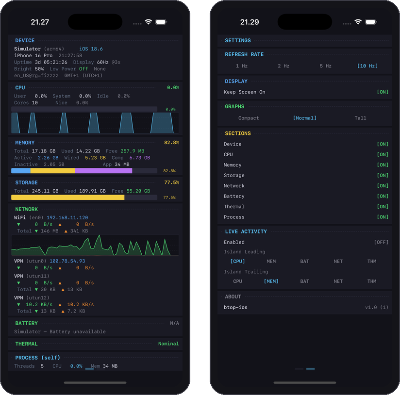
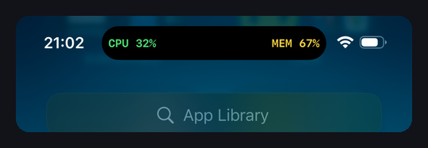
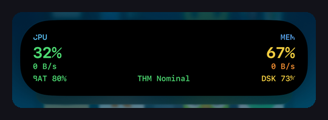

# btop-ios

A terminal-aesthetic system monitor for iOS. Real-time CPU, memory, storage, network, battery, and thermal metrics — all rendered in monospaced fonts with color-coded thresholds.

<p align="center">
  
</p>

## Dynamic Island

Live Activities push system metrics to the Dynamic Island and lock screen. Configurable compact view shows any two of: CPU, Memory, Battery, Network throughput, or Thermal state. Long-press expands to show everything.

<p align="center">
  
</p>
<p align="center">
  
</p>

## Features

- **Dashboard** — Device info, CPU usage with sparkline history, memory breakdown (active/wired/compressed), storage bar, per-interface network rates with graphs, battery state, thermal state, process self-metrics
- **Live Activities** — Dynamic Island compact/expanded/minimal views + lock screen widget, 2Hz updates, configurable leading/trailing metrics
- **Settings** — Refresh rate (1-10Hz), keep screen on, graph height, per-section visibility toggles, Dynamic Island metric selection
- **Design** — Dark terminal aesthetic, monospaced throughout, green/yellow/red color coding by severity thresholds

## Requirements

- iOS 18.0+
- Xcode 26+
- iPhone with Dynamic Island (for Live Activities)

## Building

```
git clone https://github.com/guitaripod/btop-ios.git
cd btop-ios
open btop-ios.xcodeproj
```

Select your device and run. No dependencies, no CocoaPods, no SPM packages.
